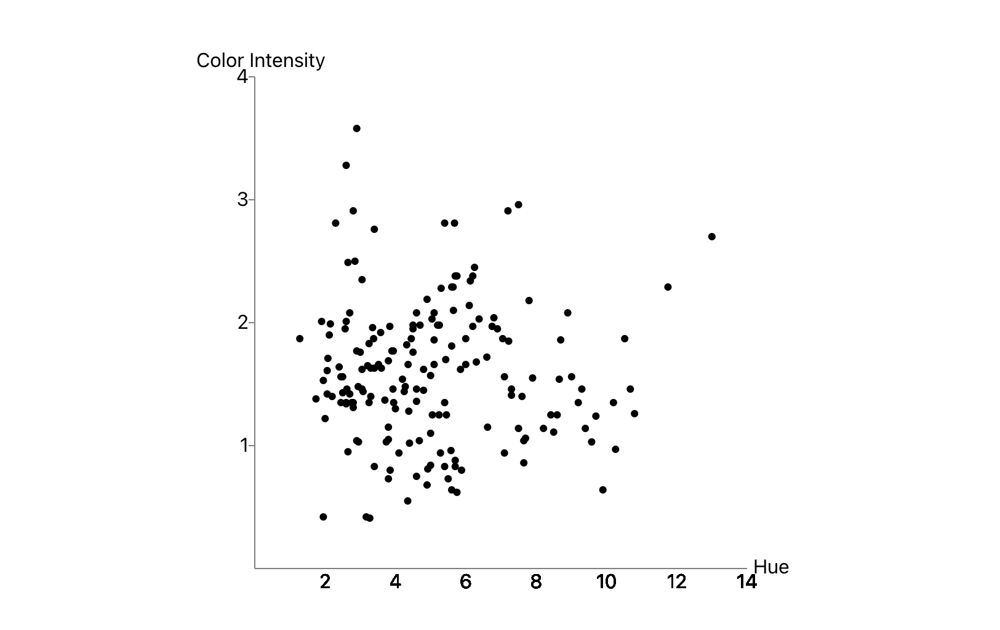

# ScatterPlot & BarChart

<h4>Tech Stack:-</h4>
<ul>
<li>HTML</li>
<li>CSS</li>
<li>JavaScript</li>
<li>ReactJS</li>
</ul>
<h3>Description</h3>

<b>BarChart:-</b> This chart contain "Alcohol" in x-axix and "Malic Acid" in y-axis

<b>ScatterPlot:-</b> This chart contain "Hue" in x-axix and "Color Intensity" in y-axis

Both of the chart have fix height and width while screen size is greater then 500. And for below 500 the charts size will decrease accordingly
